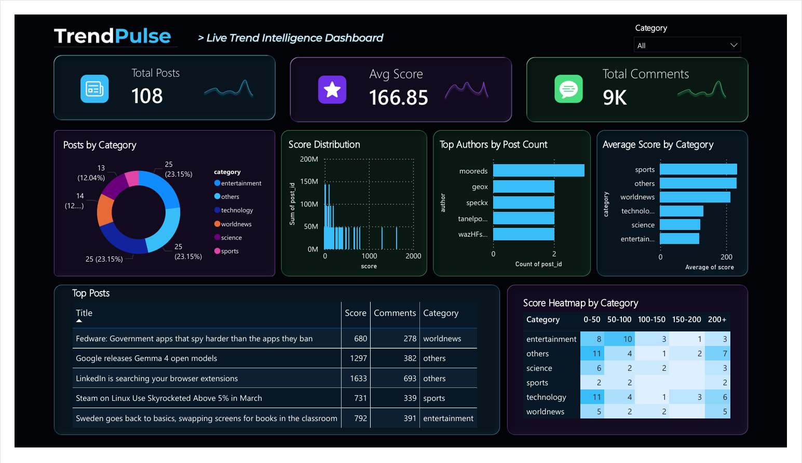

🚀 TrendPulse: What's Actually Trending Right Now

TrendPulse is a mini data pipeline project that collects and analyzes trending stories using Python and visualizes insights using Power BI.

📌 Project Overview

This project fetches real-time trending data from HackerNews API, processes it, and generates insights through analysis and interactive dashboards.

🛠️ Technologies Used

- Python
- Requests (API calls)
- Pandas (data cleaning)
- NumPy (analysis)
- Matplotlib (visualization)
- Power BI (dashboard)

📂 Project Structure

- task1_data_collection.py → Fetch data from API and store as JSON
- task2_cleaning.py → Clean and convert data to CSV
- task3_analysis.py → Analyze trends using Pandas & NumPy
- task4_visualization.py → Create charts and graphs
- TRENDPULSE_dashboard.pbix →
- Dashboard Preview

 

⚙️ How to Run

1. Install required libraries:
   pip install requests pandas numpy matplotlib

2. Run each file in order:
   python task1_data_collection.py
   python task2_cleaning.py
   python task3_analysis.py
   python task4_visualization.py

3. Open Power BI dashboard:
   TRENDPULSE_dashboard.pbix

📊 Output

- JSON file with collected data
- Cleaned CSV dataset
- Insights from analysis
- Visual charts
- Interactive Power BI dashboard

💡 Learning Outcome

- Working with APIs
- Data cleaning and preprocessing
- Data analysis using Python
- Data visualization techniques
- Building interactive dashboards

✨ Built as part of AI/ML learning journey.
